# 🃏 RummyBuddy

**RummyBuddy** is a scorekeeping mobile application built with React Native and Firebase, designed for Indian families and friend groups who traditionally play the physical version of Rummy. It offers an intuitive way to track scores across rounds, manage player re-entries, and handle various game outcomes with custom rules tailored for how the game is played in India.

---

## 📲 Tech Stack

- **Framework**: React Native CLI
- **Backend**: Firebase Firestore
- **Authentication**: Firebase Auth
- **State Management**: Redux Toolkit
- **Navigation**: React Navigation (Stack Navigator)

---

## 🔧 Key Libraries & Packages

```js
@react-native-firebase/auth
@react-native-firebase/firestore
@react-navigation/native
@react-navigation/stack
react-redux
@fortawesome/react-native-fontawesome
react-native-bootsplash

```

# 🧠 Architecture Overview

## 🔐 Authentication Flow

- **Login / Register** screens handle **Firebase-based auth**.
- Authenticated users gain access to the main game features.

---

## 🖥️ Screens

- **Home**: Entry point after login.
- **AllPlayers**: Manage players before a game.
- **StartGame**: Set game rules like total game score, drop value, middle drop value, full count value.
- **SelectPlayers**: Choose players for a game.
- **GameBoard**: Central screen to track rounds and scores.
- **ContinueGame**: Resume previously unfinished games.
- **CompletedGames**: Review finished games.
- **Compromise**: Distribute remaining amount fairly when ending early.

---

## 🧩 Modals

- **ScoreModal**: Add round scores.
- **ReEntryModal**: Handle player re-entry based on custom logic.
- **EditModal**: Edit scores of previous rounds.
- **GameSettingsModal**: Configure rules mid-game.
- **MappingModal**: Map player numbers to names for clarity.
- **CompromiseModal**: Distribute points based on drop ratios.

---

## 🗂️ Redux Slices

- **gameState**: Core game logic, current players, score tracking.
- **allPlayers**: Master list of players per user.
- **selectedPlayers**: Chosen players for a game.
- **user**: Logged-in user state.
- **continueGames**, **completedGames**: Firestore data for games.

# ✅ Features

- **Firebase Auth** for login/register
- **Add/manage players**
- **Create and continue games**
- **Real-time Firestore sync**
- **Round-wise score tracking**
- **Re-entry logic** with visual indication
- **Compromise calculation**
- **Redux-persisted state**
- **Color-coded UI feedback**
- **iOS & Android compatibility**

---

# 🛠️ Installation

```bash
git clone https://github.com/yourusername/rummybuddy.git
cd rummybuddy
npm install
npx pod-install ios
npx react-native run-android
npx react-native run-ios
```
# 📸 Screenshots

## Screens

### Login Screen  
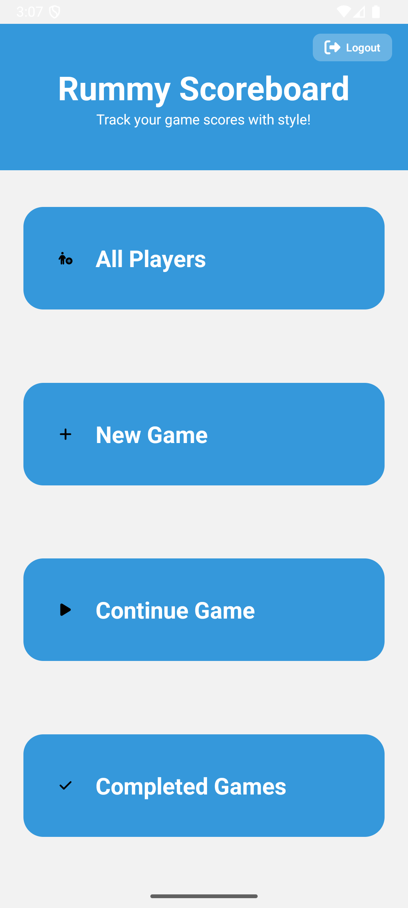

### Register Screen  
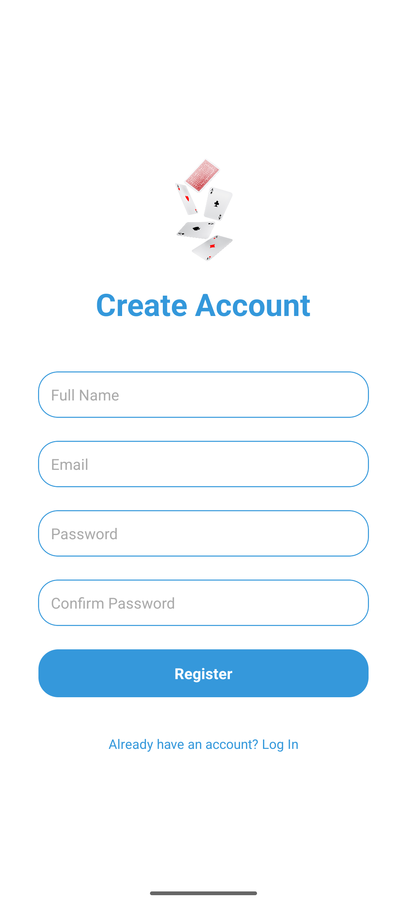

### Home Screen  


### AllPlayers Screen  
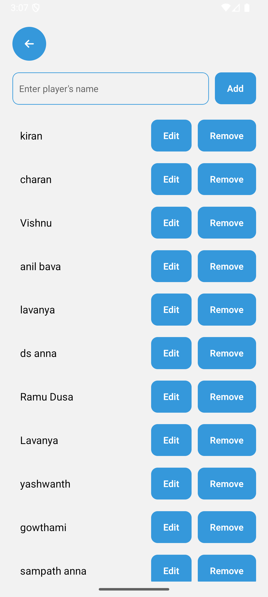

### Start Game Screen  
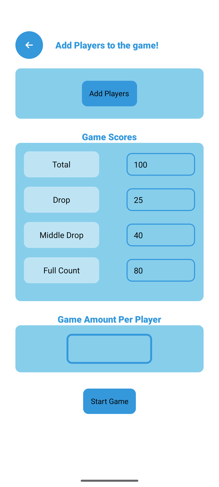

### Continue Game Screen  


### Compromise Screen  
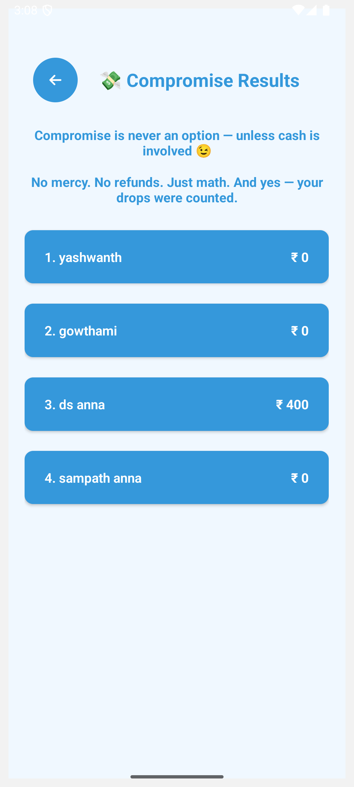

### GameBoard Screen  
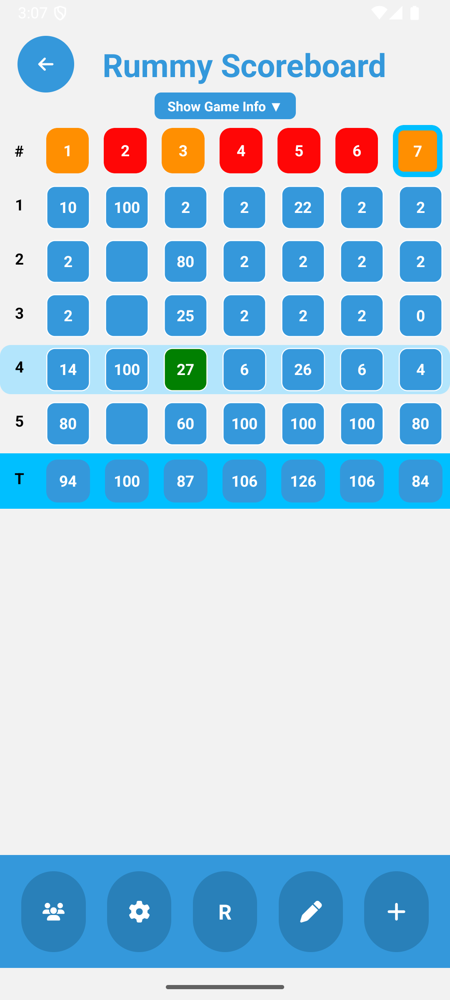

### GameBoard with Info Screen  
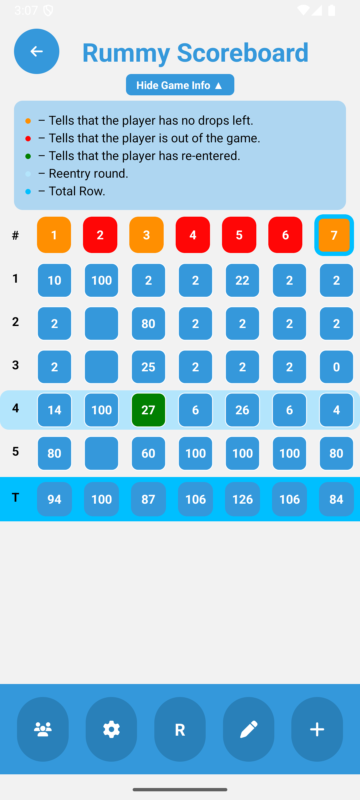

## Modals

### Edit Modal  
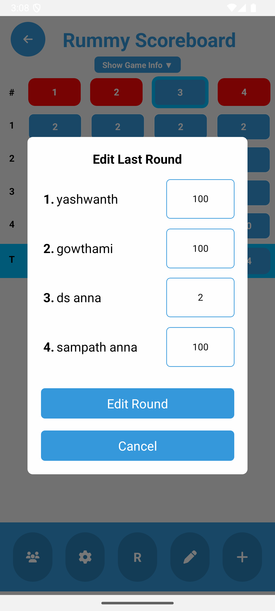

### Enter Modal  
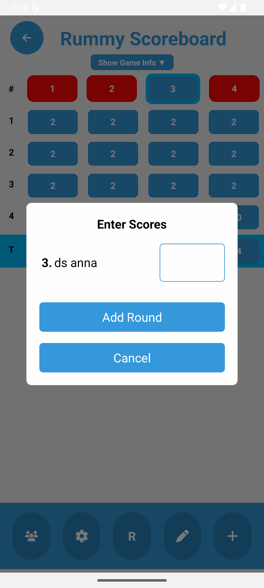

### Gamesettings Modal  
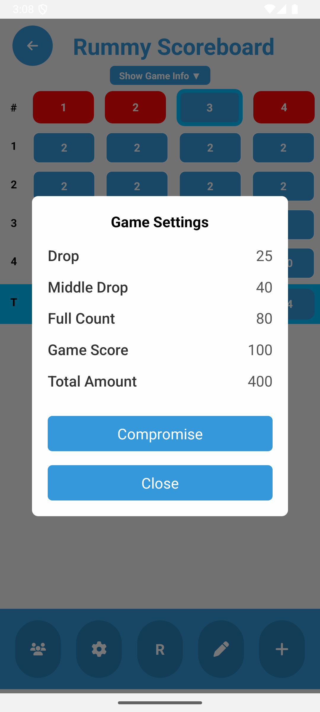

### Players Mapping Modal  


### Re-Entry Modal  
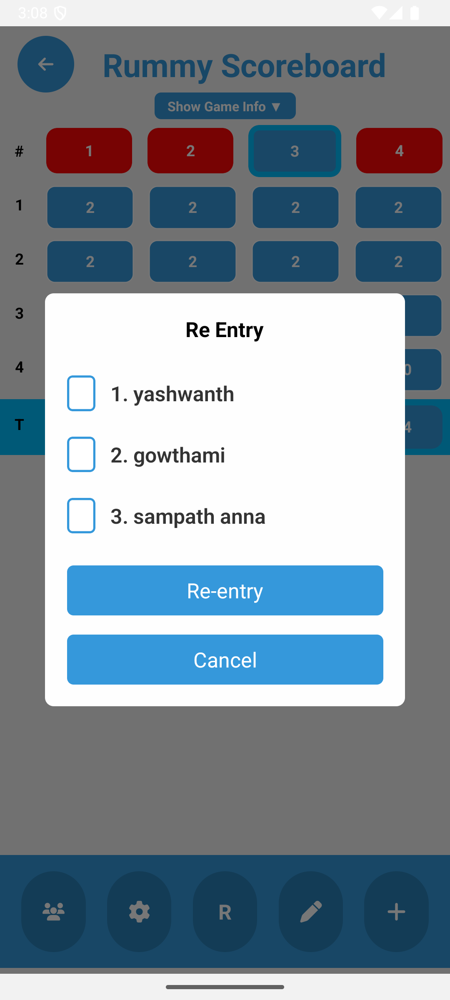

### Winner Modal  
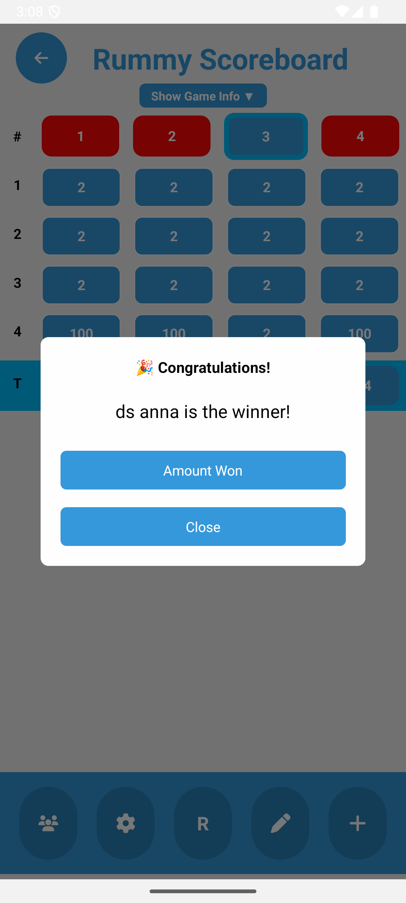
