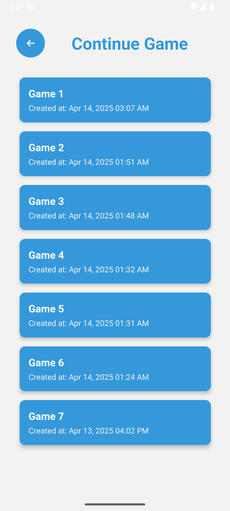

# 🃏 RummyBuddy – Traditional Rummy, Simplified Digitally

**RummyBuddy** is a scorekeeping companion app developed in **React Native**, designed for Indian families and friend groups who play the physical version of **13-card Indian Rummy**. Instead of digitizing the card game, the app replicates the real-world scoring experience: users manually play with cards offline, then enter their scores round-by-round in the app.

---

## 📱 App Stack

| Layer         | Tech Used                      |
|---------------|--------------------------------|
| UI            | React Native CLI, FontAwesome  |
| State Mgmt    | Redux Toolkit + Redux Persist  |
| Auth & DB     | Firebase Auth + Firestore      |
| Navigation    | React Navigation Stack         |
| Styling       | Custom + StyleSheet API        |

---

## 🔑 Key Features

- 🔐 **Authentication**: Firebase Auth separates data per user account.
- 🎮 **Game Lifecycle**: Start new games, continue unfinished ones, and view completed games with detailed round history.
- 👥 **Dynamic Player Management**: Add players globally, then select a subset for each game session.
- 📝 **Score Tracking**: Input scores for each round, with total tracking and visual status cues.
- 🔁 **Re-entry System**: Allow eliminated players to rejoin with fair game mechanics and colored cell indicators.
- 🧮 **Compromise Logic**: Fairly distribute remaining pool if players decide to end a game early.
- 🔄 **Redux + Firebase Optimization**: Minimizes Firestore usage by persisting game state locally and syncing on key lifecycle events (e.g. logout, background, app close).
- 🔄 **Custom Round Dealer Logic**: Smart algorithm to determine the card distributor each round, excluding eliminated players dynamically.
- 🎨 **Visual Cues**: Color-coded UI for active, danger, out, and reentry statuses; clearly shows winner state.
- 🛡 **Resilience**: Games persist across sessions and reinstalls via Firestore.

---

## 🔧 Development Optimizations

- ⚡ **Reduced Firestore Usage**: 80% fewer reads/writes by syncing only on logout, background, and startup.
- 🧠 **Persisted Redux Store**: Game state managed fully in Redux with `redux-persist` for offline use.
- 📉 **Scalable Design**: No tight coupling between rounds, players, or devices—future multiplayer sync possible.

---

## 🧩 Core Redux Slices

- `gameState`: Main gameplay data – players, rounds, scores, settings.
- `allPlayers`: Full player list per user.
- `selectedPlayers`: Per-game subset of players.
- `user`: Auth info.
- `continueGames` & `completedGames`: Firestore synced only at key moments.

---

## 📺 UI Previews

💻 **Screens**: Home, Login, Register, AllPlayers, StartGame, ContinueGame, GameBoard, Compromise  
🪟 **Modals**: Enter Scores, Edit Round, Re-Entry, Game Settings, Player Mapping, Compromise Logic

# 📸 Screenshots

## Screens

### Login Screen  

### Register Screen  

### Home Screen  

### AllPlayers Screen  

### Start Game Screen  

### Continue Game Screen  

### Compromise Screen  

### GameBoard Screen  

### GameBoard with Info Screen  

## Modals

### Edit Modal  

### Enter Modal  

### Gamesettings Modal  

### Players Mapping Modal  

### Re-Entry Modal  

### Winner Modal  

